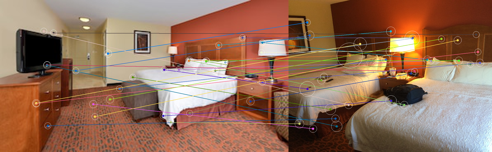

# tcam
Exploratory work on the hotel image search tool "Traffickcam" based on preexisting work by Stylianou, Pless, and others.

## Hello, World!
We have begun computing the [r2d2](papers/r2d2.pdf) features of images from hotel rooms. 
Here is an image showing closely matching points across images of two different hotel rooms from the same chain.

Here is a view of the circles showing the size of the r2d2 points.

